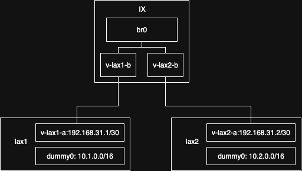

# Netapply

## What is This

Netapply is a declarative network configuration utility. You define the desired state of network configuration in structured text like YAML, then netapply will apply such configuration for you and ensure that the actual state eventually converge to the spec.

## How to Install

Currently only linux systems are supported:

```shell
go install github.com/internetworklab/netapply@latest
```

Or you may build it from the source:

```shell
git clone github.com/internetworklab/netapply
cd netapply
go build -o bin/netapply ./main.go
```

## How it Works

Here's the main steps the program takes:

1. Parse the YAML file from stdin/file/URL, and yields an object of struct type [`GlobalConfig`](./pkg/models/types.go#L15) if success, which is simply a dictionary that maps node name to node's [`NodeConfig`](./pkg/models/types.go#L35) .
2. Many golang receiver methods are bound to the [`NodeConfig`](./pkg/models/types.go#L35) struct type, it calls [`Up()`](./pkg/models/methods.go#L14) to realize the specified `NodeConfig` into current node. It detects the differences between the spec and the actual state in current node, and reconverges both.
3. During the reconverging process, it may creates and starts necessary containers (using docker sdk), creates and setups necessary (virtual) network interfaces (using netlink), but it mainly relys on container to separate the affects from the host environments.
4. You can clean all containers it ever created by invoke `netapply down --service-name <servicename>`, so that it stops and removes all containers it ever created.

## Example configurations

### Experiment one: Simple OSPF



You will create two containers, 'lax1' and 'lax2', to simulate two nodes respectively, and create a container named 'ix' to simulate an Internet Exchange. The following network resources will be created:

1. Inside the container 'ix', create br0 of type bridge.
2. Create a veth pair with one end in lax1 and the other in ix, named v-lax1-a and v-lax1-b respectively. Connect v-lax1-b to br0 and assign the IP address (in CIDR notation) 192.168.31.1/30 to v-lax1-a.
3. Create a veth pair with one end in lax2 and the other in ix, named v-lax2-a and v-lax2-b respectively. Connect v-lax2-b to br0 and assign the IP address (in CIDR notation) 192.168.31.2/30 to v-lax2-a.
4. In lax1, create a dummy-type interface dummy0 and assign the IP address (in CIDR notation) 10.1.0.0/16.
5. In lax2, create a dummy-type interface dummy0 and assign the IP address (in CIDR notation) 10.2.0.0/16.
6. Configure lax1 to advertise the stub subnet 10.1.0.0/16 to lax2 via OSPF.
7. Configure lax2 to advertise the stub subnet 10.2.0.0/16 to lax1 via OSPF.

This is how you would do it in a declarative way, describing by YAML manifest:

```yaml
nodes:
  testnode:
    frr_containers:
      - container_name: lax1
        image: quay.io/frrouting/frr:10.3.0
        hostname: lax1
      - container_name: lax2
        image: quay.io/frrouting/frr:10.3.0
        hostname: lax2
      - container_name: ix
        image: quay.io/frrouting/frr:10.3.0
        hostname: ix
    containers:
      - lax1
      - lax2
      - ix
    stateful_dir: /root/projects/netapply/nodes/testnode/.go-reconciler-state
    dataplane:
      dummy:
        - name: dummy0
          container_name: lax1
          addresses:
            - cidr: "10.1.0.0/16"
        - name: dummy0
          container_name: lax2
          addresses:
            - cidr: "10.2.0.0/16"
      veth:
        - name: v-lax1-a
          container_name: lax1
          addresses:
            - cidr: "192.168.31.1/30"
          peer:
            name: v-lax1-b
            container_name: ix
        - name: v-lax2-a
          container_name: lax2
          addresses:
            - cidr: "192.168.31.2/30"
          peer:
            name: v-lax2-b
            container_name: ix
      bridge:
        - name: br0
          container_name: ix
          slave_interfaces:
            - v-lax1-b
            - v-lax2-b
    controlplane:
      - container_name: lax1
        debug_ospf_updates: true
        ospfv2:
          - vrf: default
            router_id: "0.0.0.1"
            interfaces:
              - name: dummy0
                area: "0.0.0.0"
                passive: true
              - name: v-lax1-a
                area: "0.0.0.0"
                network: point-to-multipoint
            nbma_neighbors:
              - "192.168.31.2"
      - container_name: lax2
        debug_ospf_updates: true
        ospfv2:
          - vrf: default
            router_id: "0.0.0.2"
            interfaces:
              - name: dummy0
                area: "0.0.0.0"
                passive: true
              - name: v-lax2-a
                area: "0.0.0.0"
                network: point-to-multipoint
            nbma_neighbors:
              - "192.168.31.1"
```

Save above YAML manifest to [examples/topology1.yaml](./examples/topology1.yaml) and run

```shell
# (in project's root)
go build -o bin/netapply ./main.go
./bin/netapply up --service-name exp1 --node testnode --config ./examples/topology1.yaml
```

To clean up the test environment, invoke:

```shell
./bin/netapply down --service-name exp1
```

And this is how you would implement it using traditional linux shell commands (netlink, docker, etc.):

```shell
# use /etc/frr/daemons as a usable frr daemons config,
# so this assume that your node have an already installed frr instance on host

# create lax1, lax2, and ix
for name in lax1 lax2 ix; do
  docker run --rm -dit --name "$name" --hostname "$name" --cap-add net_admin --cap-add sys_admin -v /etc/frr/daemons:/etc/frr/daemons:ro quay.io/frrouting/frr:10.3.0
done

# getting container pid
pidLax1=$(docker inspect lax1 --format {{.State.Pid}})
pidLax2=$(docker inspect lax2 --format {{.State.Pid}})
pidIx=$(docker inspect ix --format {{.State.Pid}})

# creating veth pairs and bridge inside container
ip l add v-lax1-a netns $pidLax1 type veth peer name v-lax1-b netns $pidIx
ip l add v-lax2-a netns $pidLax2 type veth peer name v-lax2-b netns $pidIx
ip l add br0 netns $pidIx type bridge
ip l add dummy0 netns $pidLax1 type dummy
ip l add dummy0 netns $pidLax2 type dummy

# setting virtual interfaces up
docker exec -it lax1 ip l set v-lax1-a up
docker exec -it lax1 ip l set dummy0 up

docker exec -it lax2 ip l set v-lax2-a up
docker exec -it lax2 ip l set dummy0 up

docker exec -it ix ip l set br0 up
docker exec -it ix ip l set v-lax1-b up
docker exec -it ix ip l set v-lax2-b up

# connecting veth and bridge
docker exec -it ix ip l set v-lax1-b master br0
docker exec -it ix ip l set v-lax2-b master br0

# checking connectivity
docker exec -it lax1 ping -c3 ff02::1%v-lax1-a
docker exec -it lax2 ping -c3 ff02::1%v-lax2-a

# assigning ip addresses
docker exec -it lax1 ip a add 192.168.31.1/30 dev v-lax1-a
docker exec -it lax1 ip a add 10.1.0.0/16 dev dummy0
docker exec -it lax2 ip a add 192.168.31.2/30 dev v-lax2-a
docker exec -it lax2 ip a add 10.2.0.0/16 dev dummy0

# checking connectivity again
docker exec -it lax1 ping -c1 192.168.31.2
docker exec -it lax2 ping -c1 192.168.31.1

# checking routes
docker exec -it lax1 ip r | grep '10.2.0.0'  # expects empty
docker exec -it lax2 ip r | grep '10.1.0.0'  # expects empty
```

Configuring FRR on lax1:

```vtysh
lax1# configure terminal
lax1(config)# router ospf
lax1(config-router)# ospf router-id 0.0.0.1
lax1(config-router)# neighbor 192.168.31.2
lax1(config-router)# exit
lax1(config)# interface v-lax1-a
lax1(config-if)# ip ospf area 0.0.0.0
lax1(config-if)# ip ospf network point-to-multipoint non-broadcast 
lax1(config-if)# exit
lax1(config)# interface dummy0 
lax1(config-if)# ip ospf area 0.0.0.0
lax1(config-if)# ip ospf passive 
lax1(config-if)# exit
lax1(config)# exit
lax1# exit
```

Configuring FRR on lax2:

```vtysh
lax2# configure terminal
lax2(config)# router ospf
lax2(config-router)# ospf router-id 0.0.0.2
lax2(config-router)# neighbor 192.168.31.1
lax2(config-router)# exit
lax2(config)# interface v-lax2-a
lax2(config-if)# ip ospf area 0.0.0.0
lax2(config-if)# ip ospf network point-to-multipoint non-broadcast 
lax2(config-if)# exit
lax2(config)# interface dummy0 
lax2(config-if)# ip ospf area 0.0.0.0
lax2(config-if)# ip ospf passive 
lax2(config-if)# exit
lax2(config)# exit
lax2# exit
```

Checking routes again:

```shell
docker exec lax1 vtysh -c 'show ip ospf route' 2>/dev/null
docker exec lax2 vtysh -c 'show ip ospf route' 2>/dev/null
docker exec lax1 ip r | grep 10.2.0.0
docker exec lax2 ip r | grep 10.1.0.0
```

Checking network connectivity:

```shell
docker exec -it lax1 ping -c3 10.2.0.0
docker exec -it lax2 ping -c3 10.1.0.0
```

Clean up the test environments:

```shell
for name in lax1 lax2 ix; do
  docker stop "$name"
done
```

### Experiment two: Simple BGP

You will reuse the network topology from experiment one. However, the control plane in experiment two differs, as it utilizes BGP instead of the OSPF used in experiment one.

You need to perform the following configurations:

1. Configure the FRR on the lax1 node so that lax1 advertises 10.1.0.0/16 to lax2 via BGP.
2. Configure the FRR on the lax2 node so that lax2 advertises 10.2.0.0/16 to lax1 via BGP.
3. Verify that lax1 receives the route for 10.2.0.0/16 advertised by lax2 via BGP.
4. Verify that lax2 receives the route for 10.1.0.0/16 advertised by lax1 via BGP.

Before proceed to experiment two, make sure that you have clean up the environment setup by experiment one.

In YAML, you can delcare it in this way:

```yaml
nodes:
  testnode:
    frr_containers:
      - container_name: lax1
        image: quay.io/frrouting/frr:10.3.0
        hostname: lax1
      - container_name: lax2
        image: quay.io/frrouting/frr:10.3.0
        hostname: lax2
      - container_name: ix
        image: quay.io/frrouting/frr:10.3.0
        hostname: ix
    containers:
      - lax1
      - lax2
      - ix
    stateful_dir: /root/projects/netapply/nodes/testnode/.go-reconciler-state
    dataplane:
      dummy:
        - name: dummy0
          container_name: lax1
          addresses:
            - cidr: "10.1.0.0/16"
        - name: dummy0
          container_name: lax2
          addresses:
            - cidr: "10.2.0.0/16"
      veth:
        - name: v-lax1-a
          container_name: lax1
          addresses:
            - cidr: "192.168.31.1/30"
          peer:
            name: v-lax1-b
            container_name: ix
        - name: v-lax2-a
          container_name: lax2
          addresses:
            - cidr: "192.168.31.2/30"
          peer:
            name: v-lax2-b
            container_name: ix
      bridge:
        - name: br0
          container_name: ix
          slave_interfaces:
            - v-lax1-b
            - v-lax2-b
    controlplane:
      - container_name: lax1
        debug_bgp_updates: true
        route_map:
          - name: allow-all
            policy: permit
            order: 10
        bgp:
          - vrf: default
            asn: 65001
            router_id: "0.0.0.1"
            address_families:
              - afi: ipv4
                safi: unicast
                networks:
                  - "10.1.0.0/16"
                activate:
                  - group1
            neighbors:
              group1:
                asn: 65002
                peers:
                  - "192.168.31.2"
                route_maps:
                  - name: allow-all
                    direction: in
                  - name: allow-all
                    direction: out
      - container_name: lax2
        debug_bgp_updates: true
        route_map:
          - name: allow-all
            policy: permit
            order: 10
        bgp:
          - vrf: default
            asn: 65002
            router_id: "0.0.0.2"
            address_families:
              - afi: ipv4
                safi: unicast
                networks:
                  - "10.2.0.0/16"
                activate:
                  - group1
            neighbors:
              group1:
                asn: 65001
                peers:
                  - "192.168.31.1"
                route_maps:
                  - name: allow-all
                    direction: in
                  - name: allow-all
                    direction: out
```

You can apply above YAML manifest by:

```shell
./bin/netapply up --service-name exp2 --node testnode --config ./examples/topology1-bgp.yaml
```

You can clean up above test environment by:

```shell
./bin/netapply down --service-name exp2
```

Alternatively, with CLI, you might also apply below configurations to vtysh of lax1 and lax2 respectively, to achieve equivalent effect:

On vtysh of lax1:

```vtysh
lax1# configure terminal
lax1(config)# route-map allow-all permit 10
lax1(config-route-map)# exit
lax1(config)# router bgp 65001
lax1(config-router)# bgp router-id 0.0.0.1
lax1(config-router)# neighbor group1 peer-group 
lax1(config-router)# neighbor group1 remote-as 65001
lax1(config-router)# neighbor 192.168.31.2 peer-group group1
lax1(config-router)# address-family ipv4 unicast 
lax1(config-router-af)# neighbor group1 activate 
lax1(config-router-af)# neighbor group1 route-map allow-all in
lax1(config-router-af)# neighbor group1 route-map allow-all out
lax1(config-router-af)# network 10.1.0.0/16
lax1(config-router-af)# exit-address-family 
lax1(config-router)# exit
lax1(config)# exit
lax1# exit
```

On vtysh of lax2:

```vtysh
lax2# configure terminal
lax2(config)# route-map allow-all permit 10
lax2(config-route-map)# exit
lax2(config)# router bgp 65002
lax2(config-router)# bgp router-id 0.0.0.2
lax2(config-router)# neighbor group1 peer-group 
lax2(config-router)# neighbor group1 remote-as 65001
lax2(config-router)# neighbor 192.168.31.1 peer-group group1
lax2(config-router)# address-family ipv4 unicast 
lax2(config-router-af)# neighbor group1 activate 
lax2(config-router-af)# neighbor group1 route-map allow-all in
lax2(config-router-af)# neighbor group1 route-map allow-all out
lax2(config-router-af)# network 10.2.0.0/16
lax2(config-router-af)# exit-address-family 
lax2(config-router)# exit
lax2(config)# exit
lax2# exit
```

### Experiment three: Simple WireGuard

See [./examples/topology2-wg.yaml)](./examples/topology2-wg.yaml)

```yaml
nodes:
  testnode:
    frr_containers:
      - container_name: lax1
        image: quay.io/frrouting/frr:10.3.0
        hostname: lax1
      - container_name: lax2
        image: quay.io/frrouting/frr:10.3.0
        hostname: lax2
    containers:
      - lax1
      - lax2
    stateful_dir: /root/projects/netapply/nodes/testnode/.go-reconciler-state
    dataplane:
      wireguard:
        - name: wg-lax1-1
          listen_port: 14141
          container_name: lax1
          privatekey: "6DFfR3+61f/X+zGqeQ+ka7XxQG1ScqQvvZbk/0hgkWo="
          peers:
            - publickey: "vniXpqDKla2+K/RDZT+81H/MHrKvWwjPojCFP72GZHM="
              endpoint: "lax1.exploro.one:14142"
              allowedips:
                - "0.0.0.0/0"
                - "::/0"
          addresses:
            - cidr: "10.1.0.1/30"
          mtu: 1420
        - name: wg-lax2-1
          listen_port: 14142
          container_name: lax2
          privatekey: "EJNljli1ZIkW1j1WHzWlPUcnpzWHrtTqDAbJuF8KukQ="
          peers:
            - publickey: "b9fucppbWxKLAWSxn8UJY5NlcnPF+Yz6s64XJwOdPAg="
              allowedips:
                - "0.0.0.0/0"
                - "::/0"
          addresses:
            - cidr: "10.1.0.2/30"
          mtu: 1420
```

To test inter-container wg connectivity:

```shell
docker exec -it lax1 ping -c3 10.1.0.2
docker exec -it lax2 ping -c3 10.1.0.1
```

### Experiment four: VxLAN over WireGuard

The network topology will looks like this

```
+-------------+        +-------------+        +-------------+
| lax1        |   wg   | lax2        |   wg   | rr          |
| 10.1.0.1/24 | <====> | 10.1.0.2/24 | <====> | 10.1.0.3/24 |
+-------------+        +-------------+        +-------------+
```

However we use the interconnected L3 network as a underlay, to support a VxLAN overlay build upon lax1 and lax2.

Where 'rr' means 'BGP Route Reflector'.


(More Example configuration YAMLs are coming ...)

## Others

About how to generate keys for OpenVPN2 serverside and clientside:

1. Generate server's DH parameters by `./generate-dh-param.sh` if it is not generated yet;
2. Generate client's cert pair by `./generate-client.sh`, modify the CN field for a different CommonName;
3. Generate server's cert pair by `./generate-server.sh`, modify the CN field for a different CommonName.

